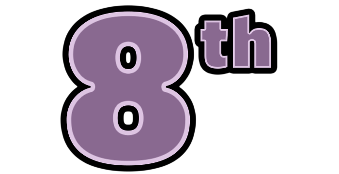
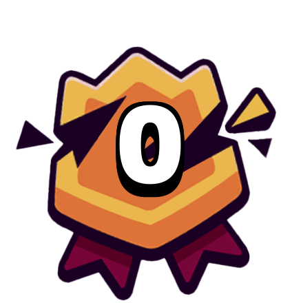
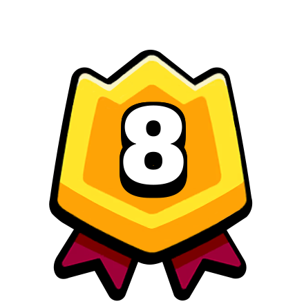
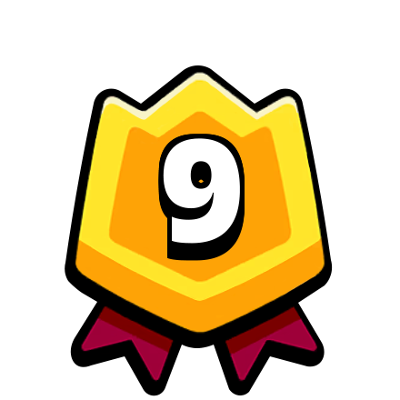
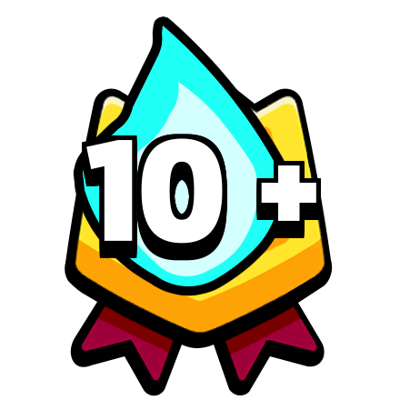

# Chest Sizes

Chests that you earn after completing a battle are known as "Reward Chests". These chests can have different size (number of troops), depending on the amount of taps you have earned.

The rarity of these chests is predefined by the chest cycle, you can find more about it [here](/sb/chest_cycle).
<!---
  -->

Chests taps per chest can range from 2 to 7:
- 2 is the minimum, for finishing 9th or 10th.
- 7 is the maximum, for finishing in the top 3 with a max streak active.

The minimum amount of troops per chest is 1, but with each tap you have a chance to make it bigger.

Chests that unlock new troops don't have size increases, meaning that you'll only see rarity changes, and finally you'll get a single new troop.

The two ways to earn taps are:

[[toc]]

## Battle Placement

Depending on your battle placement, you can earn from 2 to 4 taps:

| | Placement | Bonus Taps | 
| -- | -- | -- |
|  | First | 4 Taps |
|  | Second | 4 Taps |
|  | Third | 4 Taps |
|  | Fourth | 3 Taps |
|  | Fifth | 3 Taps |
|  | Sixth | 3 Taps |
|  | Seventh | 3 Taps |
|  | Eighth | 3 Taps |
|  | Ninth | 2 Taps |
|  | Tenth | 2 Taps |

## Top 5 Streak

| | Streak Size | Bonus Taps | 
| -- | -- | -- |
|  | 0 wins | 0 Taps |
|  | 1 win | 0 Taps |
|  | 2 wins | 1 Tap |
|  | 3 wins | 1 Tap |
|  | 4 wins | 1 Tap |
|  | 5 wins | 2 Taps |
|  | 6 wins | 2 Taps |
|  | 7 wins | 2 Taps |
|  | 8 wins | 2 Taps |
|  | 9 wins | 2 Taps |
|  | 10 wins or more | 3 Taps |

# Should you pay to keep your streak?

**Usually no**, but it mainly depends on what you want to prioritise. Prices to keep your streak rise based on your streak size; you can find a list of all these prices bases [here](/sb/keep_streak_prices). 

Do you want to unlock big chests as soon as possible? If you do, keeping your streak will save you the 30 minutes that regaining a streak could take.

Do you want to use gold as efficiently as possible? In that case, give up your streak and try to start a new one. Spend that gold on more chests one you have a good streak active.

An instance in which paying for a streak can be optimal is when you have **several chests in the queue** and you are about to lose a moderate streak. For example:

- You have from 4 to 10 wins
- This is your first chest of the day, but you have 2 more in the queue

If that happens and you think you can keep your streak for the remaining chests, it will provide a similar value compared to buying more chests.

<!---
If you are keeping track of your [Chest Cycle](/sb/chest_cycle), paying for extra taps when **you know you'll get an Epic chest** may also be worth it.
  -->

# Strategy: Leave your streak ready!

To optimise your progression, one of the main things you should avoid is opening chests with no streaks active.

A good way to achieve this is always leaving your streak ready for whenever you want to continue playing. Depending on how consistent your placements are, you might prefer one of these options:

- **Easy**: just finish with one top 5! Whenever you continue playing for a chest, you'll be able to finish in the top 5 and earn the bonus tap from the 2-streak.

- **Medium**: get a 4-streak. Similar to the easy approach, your next battle allows you to start the 5-streak, which gives you an extra tap.

- **Hard**: get a 9-streak. This will be the best option if you want to earn the maximum streak bonus with your next chest.