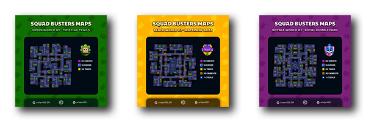
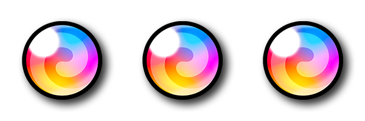
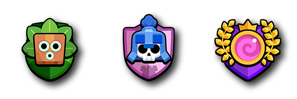

---
# https://vitepress.dev/reference/default-theme-home-page
layout: home

hero:
  name: Alpe
  text: Squad Up!
  tagline: with unique stats for your battles.
  image:
    src: /Squad_Logo_Original.png
    alt: Alpe

features:
  - icon:
      src: /appicon_sb_2cs.png
    title: Maps
    details: Find about the chests, boxes and structure of all the maps. 
    link: /sb/maps
    image: /Squad_Logo_Original.png
  - icon:
      src: /appicon_sb_2cs.png
    title: Troops
    details: Compare the HP and DPS of troops to build the best squad. 
    link: /sb/troops
  - icon:
      src: /appicon_sb_2cs.png
    title: Monsters
    details: Stats for all the enemies and bosses you'll find in battles. 
    link: /sb/monsters
  - icon:
      src: /appicon_sb_2cs.png
    title: Chest Cycle
    details: Cycle stats and how to know the rarity of your next chest. 
    link: /sb/chest_cycle
  - icon:
      src: /appicon_sb_2cs.png
    title: Chest Sizes
    details: Basic information about chest sizes, streaks and bonus taps. 
    link: /sb/chest_sizes
  - icon:
      src: /appicon_sb_2cs.png
    title: World Progression
    details: Overview of Squad Level progression based on Portal Energy. 
    link: /sb/progression_worlds
  - icon:
      src: /appicon_sb_2cs.png
    title: Mega Drop Chances
    details: Probability to get Mega troops from a chest during battles.
    link: /sb/mega_chances
  - icon:
      src: /appicon_sb_2cs.png
    title: General Tips
    details: Do you know all of them? 
    link: /sb/tips
  - icon:
      src: /appicon_sb_2cs.png
    title: Additional Resources
    details: Several links, tools and resources to external pages.
    link: /sb/resources
---

