# Squad Busters Monsters

Squads from other players aren't the only obstacles on your way to victory. You'll also have to battle against NPCs and bosses if you want to earn gems and other resources.

The main 4 categories of NPC enemies are:

[[toc]]

Most of these NPCs are also the ones you have to bust to complete the Monster tasks of the Achievements Book. This is a list of all the Monsters you can find, sorted by Hit Points.

> [!NOTE]
> Many monsters have different kinds of attack sequences, so simplifying everything into a single damage value isn't possible. The tables of each monster category show the base DPS of monsters, but many can be quite more dangerous with their super attacks or other abilities.

## [Small Monsters](/sb/monsters_small)

    

        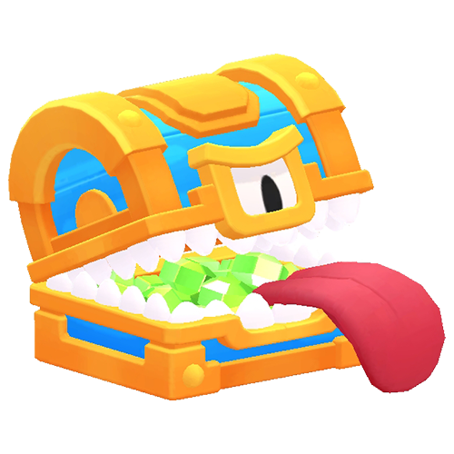
    

    

        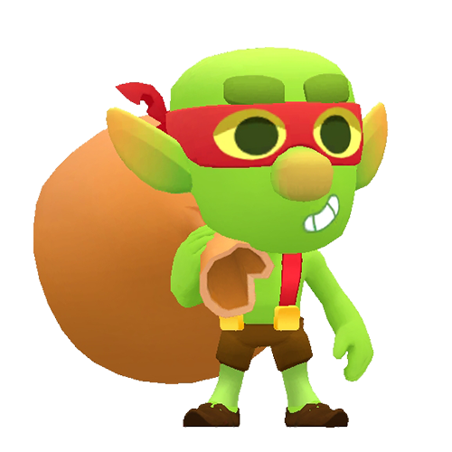
    

    

        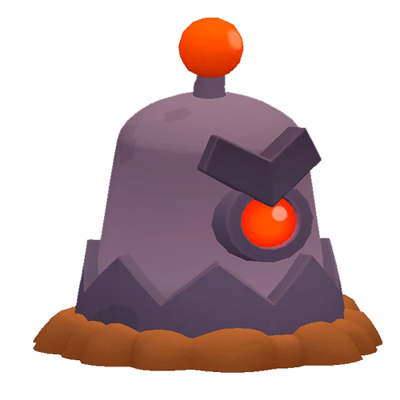
    

    

        
    

    

        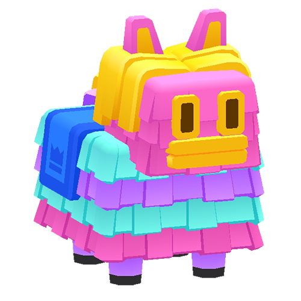
    

    

        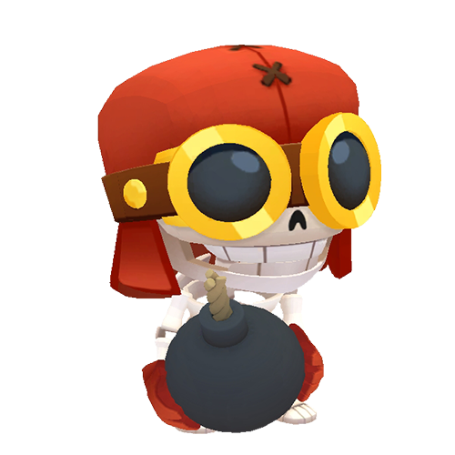
    

    

        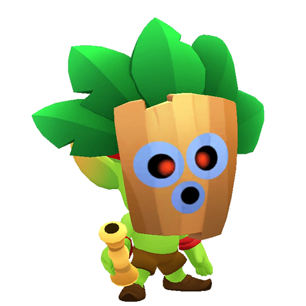
    

    

        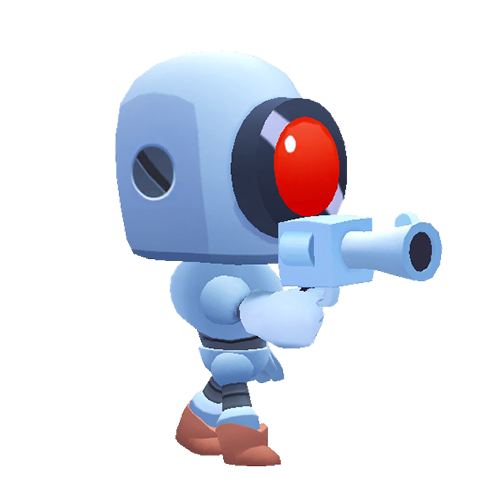
    

    

        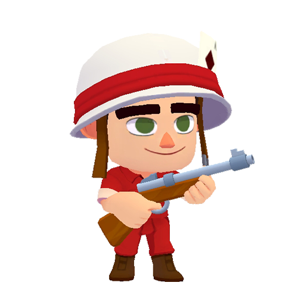
    

    

        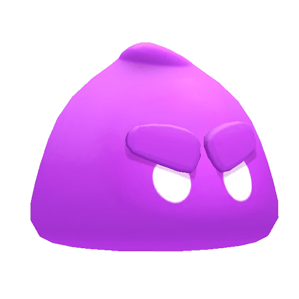
    

    

        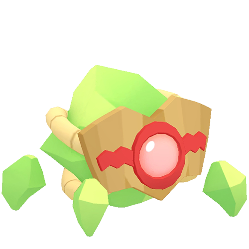
    

    

        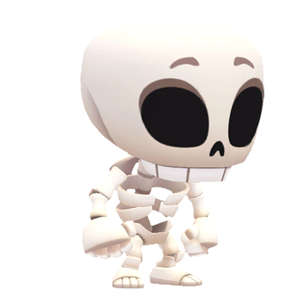
    

    

        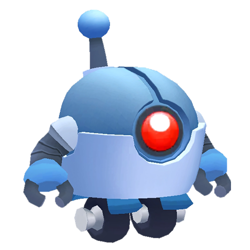
    

    

        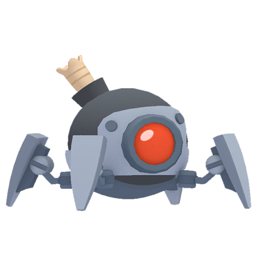
    

    

        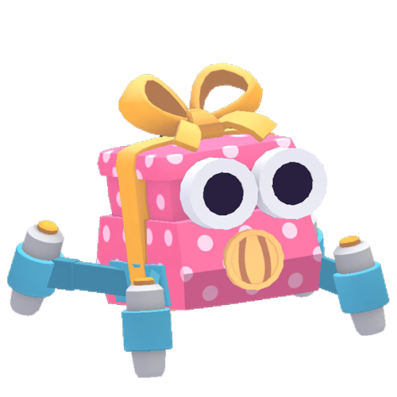
    

    

        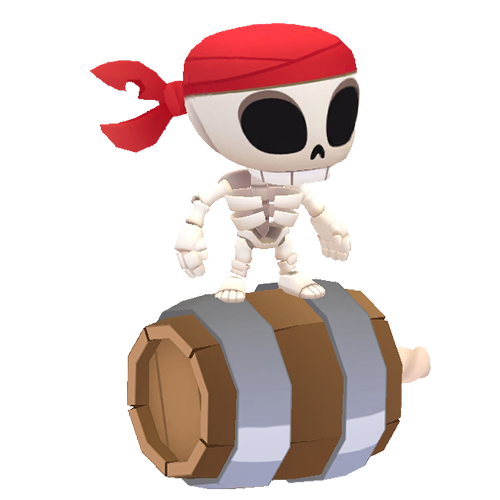
    

## [Medium Monsters](/sb/monsters_medium)

    

        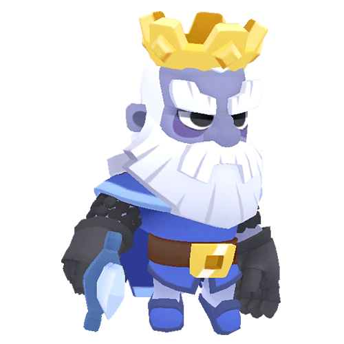
    

    

        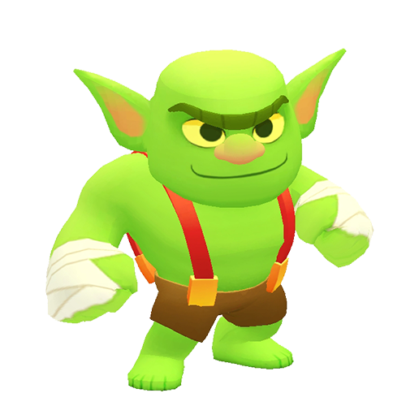
    

    

        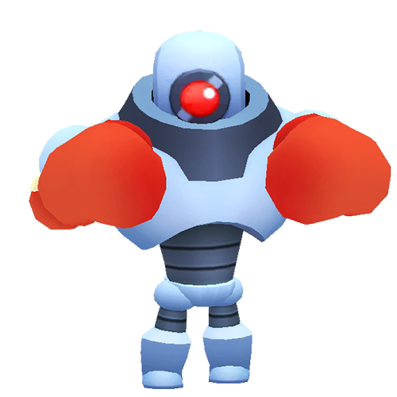
    

    

        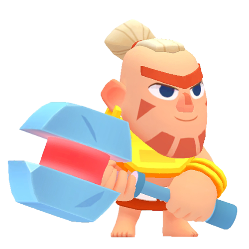
    

    

        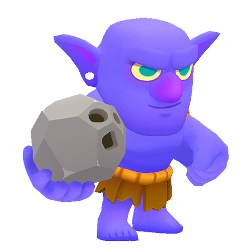
    

    

        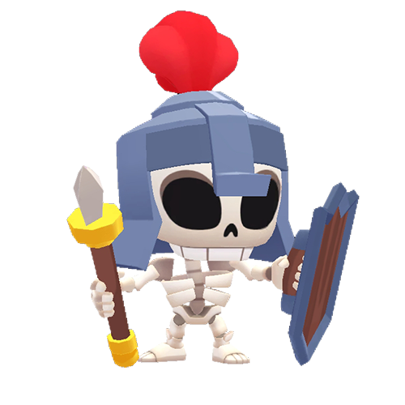
    

## [Big Monsters](/sb/monsters_big)

    

        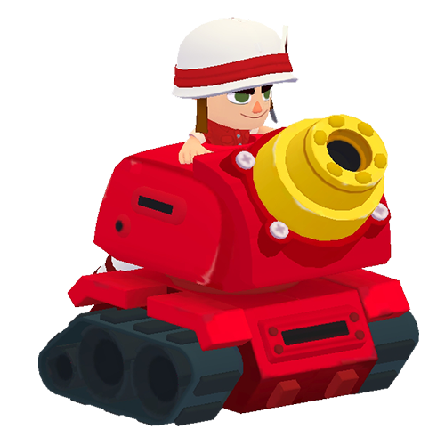
    

    

        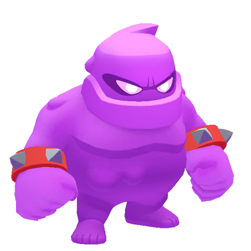
    

    

        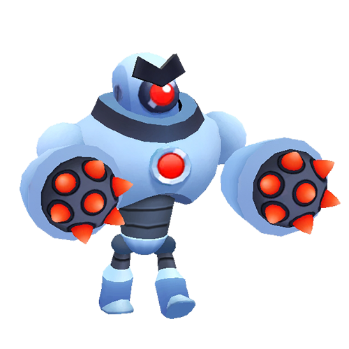
    

    

        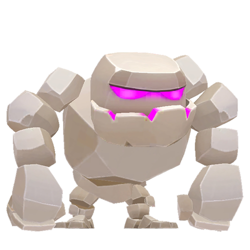
    

    

        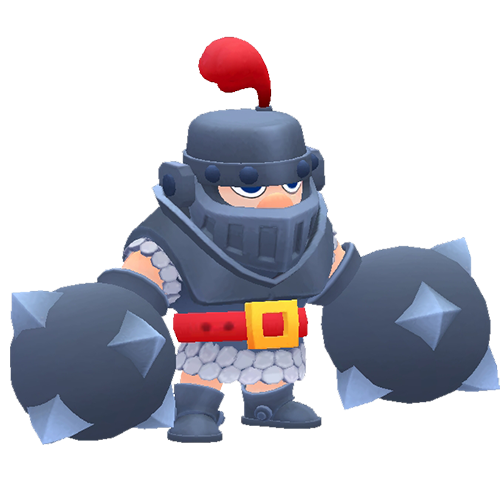
    

    

        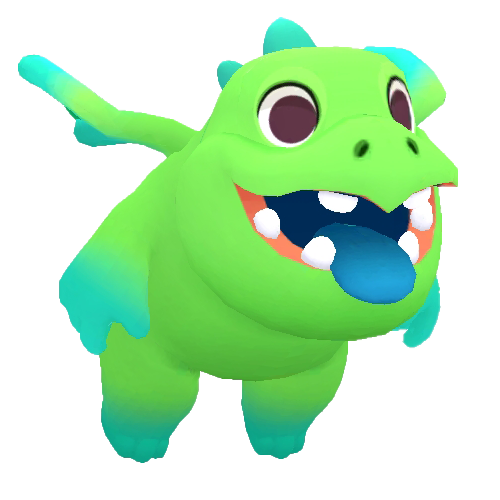
    

    

        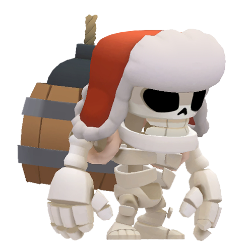
    

    

        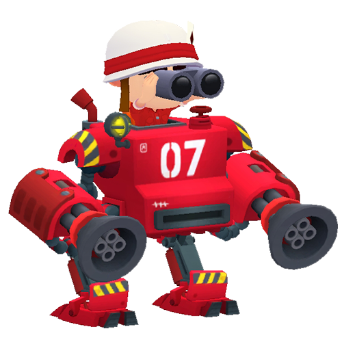
    

    

        
    

## [Bosses](/sb/monsters_bosses)

    

        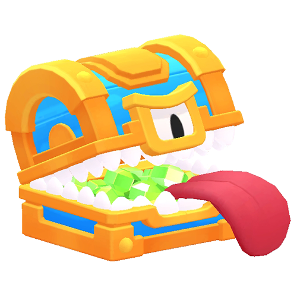
    

    

        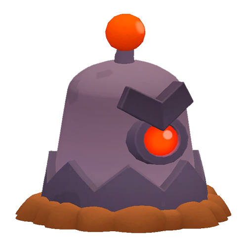
    

    

        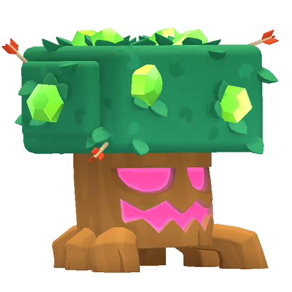
    

    

        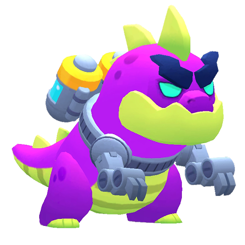
    

___

# [All Monsters](/sb/monsters_all)

A single list with all the monsters.