# All Monsters Sorted By HP

|   | Monster | HP | Base DPS | 
| -- | -- | -- | -- |
| 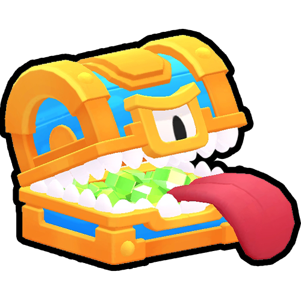 | Chest Menace | 25,000 | 67 |
| 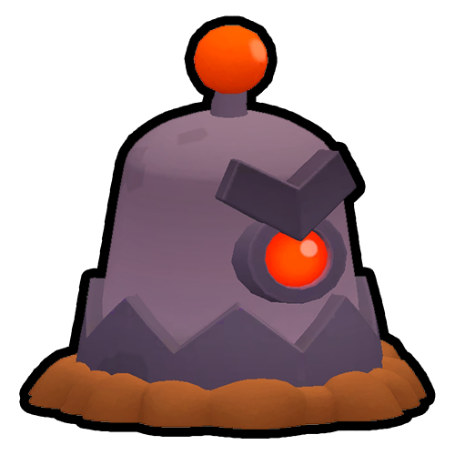 | Mega Mole | 18,000 | 333 |
| 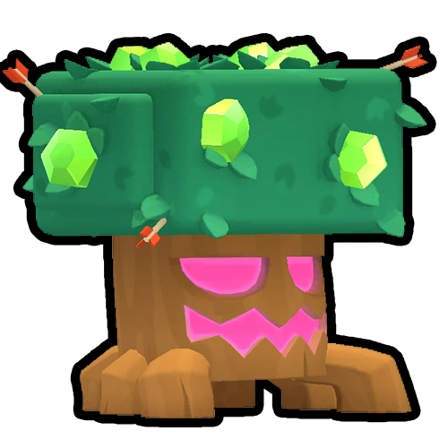 | Tree Giant | 12,000 | 75 |
| 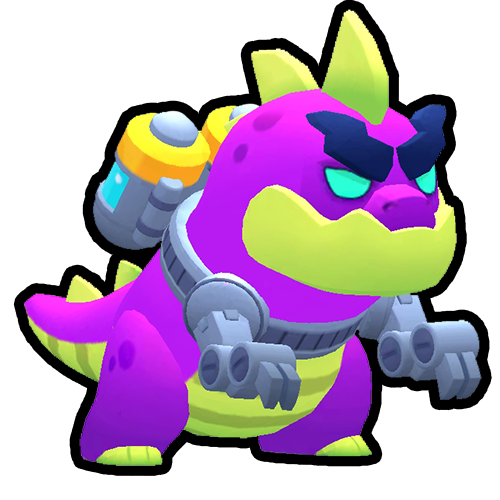 | Kaiju | 10,000 | 75 |
|  | Rain Maker | 8,000 | 20 |
| 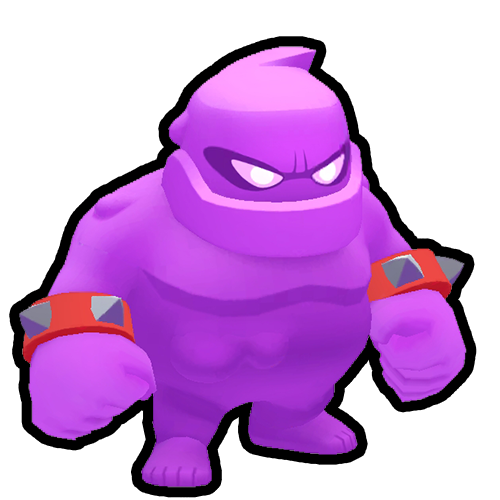 | Elixir Golem | 7,500 | 25 |
| 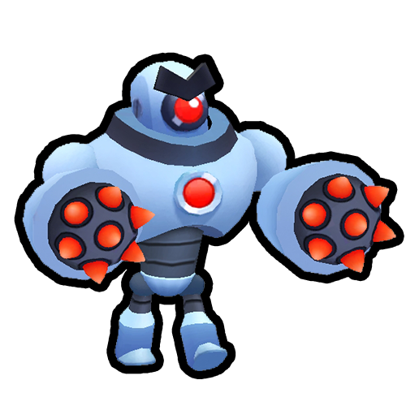 | Boss Robot | 6,000 | 25 |
| 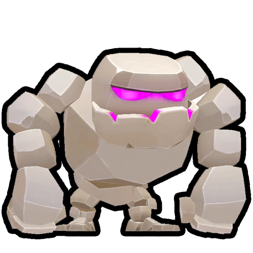 | Golem | 6,000 | 50 |
| 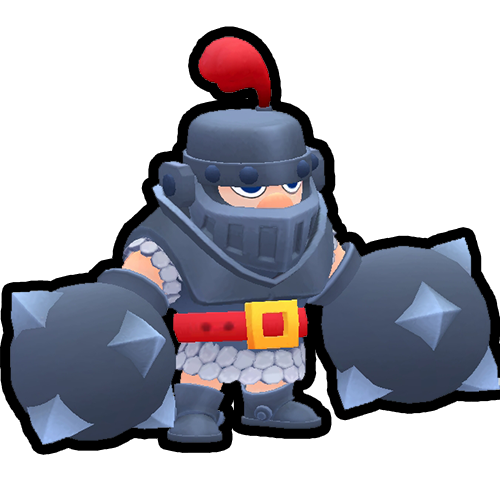 | Mega Knight | 6,000 | 35 |
| 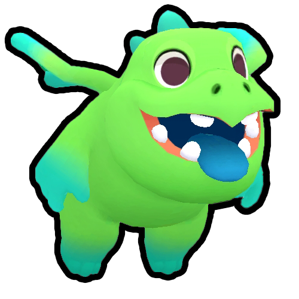 | Baby Dragon | 5,000 | 76 |
| 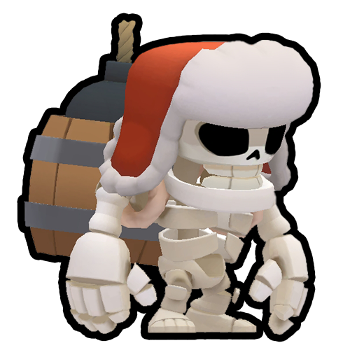 | Giant Skeleton | 5,000 | 80 |
| 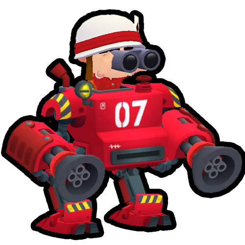 | Mech | 5,000 | 80 |
| 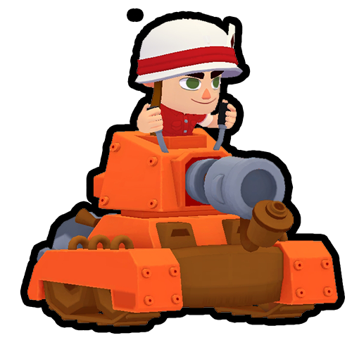 | Scorcher | 5,000 | 50 |
|  | Gift Critter Big | 4,000 | 70 |
| 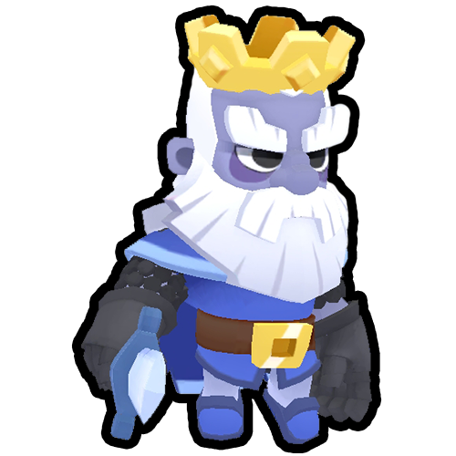 | Royal Ghost | 3,500 | 100 |
|  | Chest Imposter Epic | 3,500 | 65 |
|  | Chest Imposter Rare | 2,250 | 80 |
| 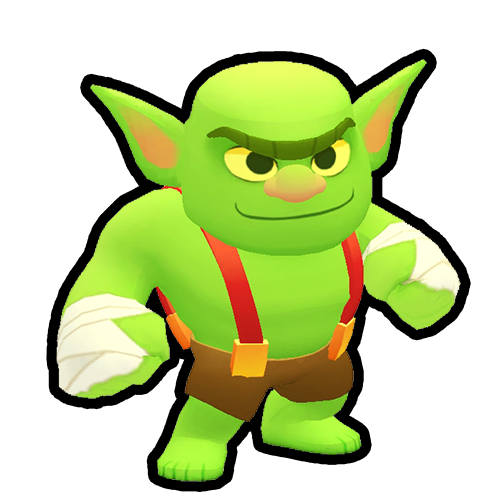 | Uncaged Goblin | 1,500 | 70 |
| 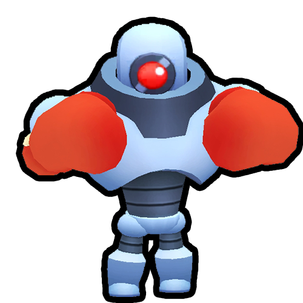 | Boxer Robot | 1,500 | 70 |
| 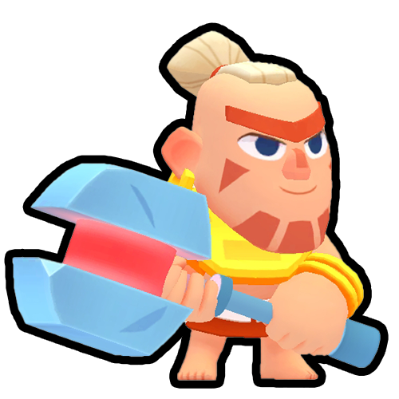 | Warrior | 1,500 | 55 |
|  | Gift Critter Medium | 1,500 | 35 |
|  | Loot Goblin | 1,500 | - |
| 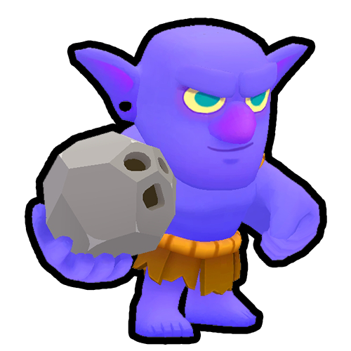 | Bowler | 1,200 | 23 |
|  | Chest Imposter Common | 1,000 | 50 |
|  | Mini Mole | 1,000 | 60 |
|  | Elite Riffleman | 700 | 70 |
|  | Piñata | 650 | - |
| 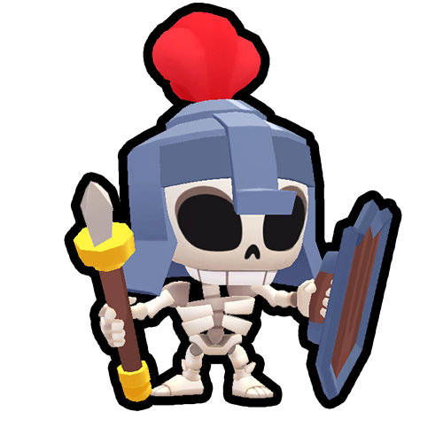 | Guards | 600 | 30 |
|  | Bomber | 400 | 30 |
|  | Dart Goblin | 400 | 50 |
|  | Sniper Robot | 400 | 50 |
|  | Riffleman | 400 | 50 |
|  | Elixir Blob | 300 | 15 |
|  | Crystal Critter | 300 | 20 |
|  | Skeleton | 300 | 20 |
|  | Mini Robot | 300 | 20 |
|  | Bomb Critter | 200 | 20 |
|  | Gift Critter Small | 200 | 15 |
|  | Wall Breaker | 50 | 40 |

