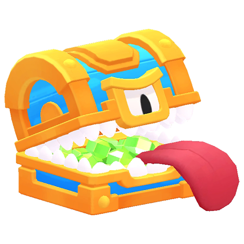

# Small Monsters Sorted By HP

|   | Monster | HP | Base DPS | 
| -- | -- | -- | -- |
|  | Chest Imposter Epic | 3500 | 65 |
|  | Chest Imposter Rare | 2250 | 80 |
|  | Loot Goblin | 1500 | - |
|  | Chest Imposter Common | 1000 | 50 |
|  | Mini Mole | 1000 | 60 |
|  | Elite Riffleman | 700 | 70 |
|  | Piñata | 650 | - |
|  | Bomber | 400 | 30 |
|  | Dart Goblin | 400 | 50 |
|  | Sniper Robot | 400 | 50 |
|  | Riffleman | 400 | 50 |
|  | Elixir Blob | 300 | 15 |
|  | Crystal Critter | 300 | 20 |
|  | Skeleton | 300 | 20 |
|  | Mini Robot | 300 | 20 |
|  | Bomb Critter | 200 | 20 |
|  | Gift Critter | 200 | 15 |
|  | Wall Breaker | 50 | 40 |

