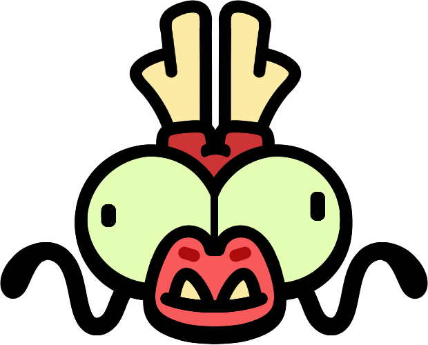
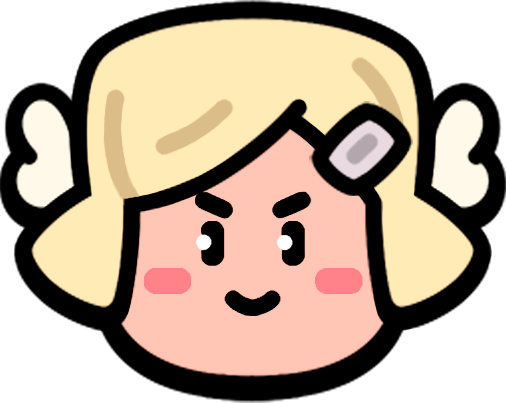
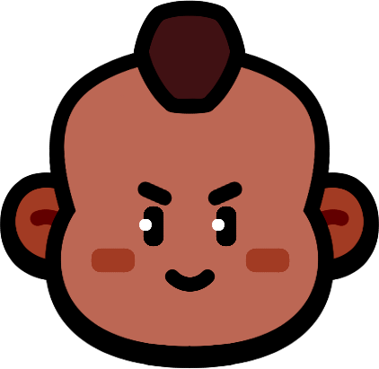
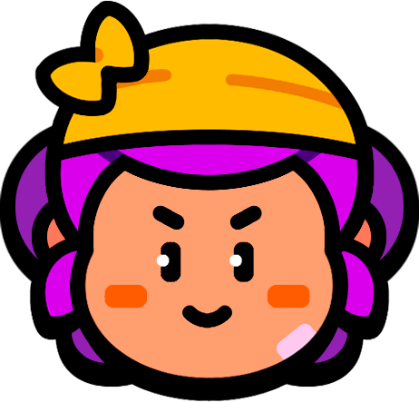
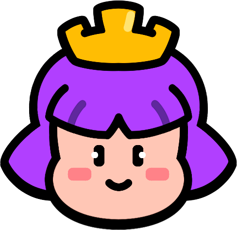
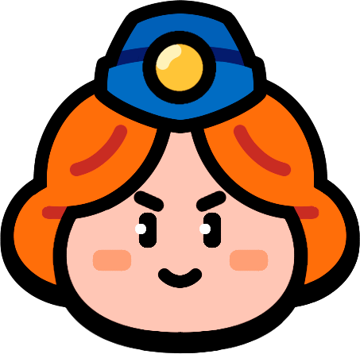
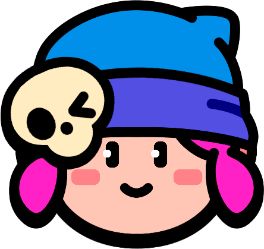
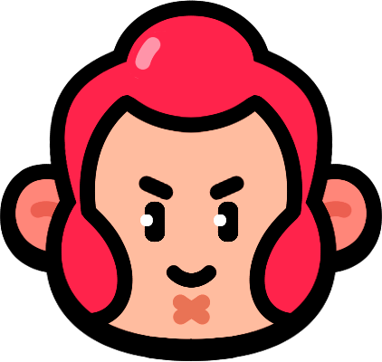

# Troops Sorted By HP

|   | Troop | HP | DPS | 
| -- | -- | -- | -- |
|  | Mega El Primo | 11000 | 237 |
|  | Mega Chicken | 8000 | 273 |
|  | Barbarian King | 3200 | 139 |
|  | El Primo | 2800 | 95 |
|  | Heavy | 2300 | 120 |
|  | Royale King | 2200 | 110 |
|  | Battle Healer | 1800 | 113 |
|  | Mortis | 1700 | 165 |
|  | Trader | 1600 | 94 |
|  | Hog Rider | 1500 | 142 |
|  | Barbarian | 1400 | 132 |
|  | Shelly | 1300 | 141 |
|  | Mavis | 1300 | 115 |
|  | Greg | 1300 | 94 |
|  | Pam | 1200 | 162 |
|  | Goblin | 1200 | 159 |
|  | Archer Queen | 1200 | 154 |
|  | Tank Girl | 1200 | 118 |
|  | Nita | 1200 | 82 |
|  | Penny | 1100 | 219 |
|  | Max | 1100 | 188 |
|  | Witch | 1000 | 212 |
|  | Chicken | 1000 | 182 |
|  | Bea | 900 | 189 |
|  | Medic | 900 | 119 |
|  | Wizard | 850 | 115 |
|  | Dynamike | 800 | 58 |
|  | Colt | 750 | 190 |
|  | Bo | 700 | 120 |

